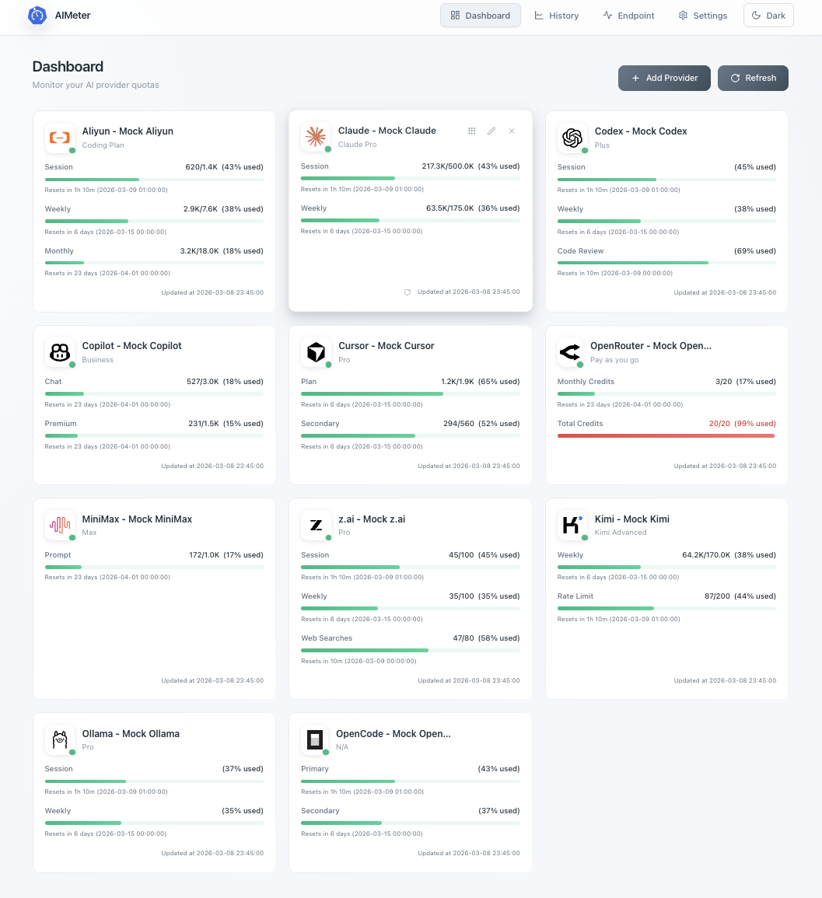

# AIMeter

AIMeter - это self-hosted панель для отслеживания использования, квот и истории нескольких AI-провайдеров в одном интерфейсе.

<div align="center">

[English](../../README.md) | [简体中文](README-zh-CN.md) | [繁體中文](README-zh-TW.md) | [日本語](README-ja.md) | [Français](README-fr.md) | [Deutsch](README-de.md) | [Español](README-es.md) | [Português](README-pt.md) | [**Русский**](README-ru.md) | [한국어](README-ko.md)

</div>

<div align="center">
  
</div>

## Возможности

- Единая панель для нескольких провайдеров
- Настройка провайдеров и управление учетными данными
- История использования и графики
- Страницы, связанные с endpoint и widget
- Автоматическое плановое обновление в режиме `node`
- Mock-режим для локальной разработки и демо
- Хранилища: SQLite, PostgreSQL, MySQL
- Модель конфигурации с приоритетом переменных окружения

## Поддерживаемые Provider

Текущие адаптеры включают:

- Aliyun
- Antigravity
- Claude
- Codex
- Kimi
- MiniMax
- z.ai
- Copilot
- OpenRouter
- Ollama
- OpenCode
- Cursor

## Технологический стек

- Frontend: React 18, TypeScript, Vite, Tailwind CSS
- Backend: Node.js, Express, TypeScript
- База данных: better-sqlite3, pg, mysql2

## Структура проекта

```text
.
├─ src/                 # Frontend-приложение
├─ server/              # Backend API, auth, jobs, storage
├─ doc/                 # Дизайн-заметки, примеры provider, переводы
├─ config.example.yaml  # Полный шаблон конфигурации
└─ .env.all         # Шаблон переменных окружения
```

## Быстрый старт

### 1. Установите зависимости

```bash
npm install
```

### 2. Подготовьте конфигурацию

```bash
cp .env.all .env
cp config.example.yaml config.yaml
```

Измените `config.yaml` и/или `.env` под ваше окружение.

### 3. Запустите frontend + backend

```bash
npm run dev:all
```

Локальные адреса по умолчанию:

- Frontend: `http://localhost:3000`
- Backend: `http://localhost:3001`

## Основные скрипты

```bash
npm run dev            # только frontend
npm run start:server   # только backend
npm run dev:all        # frontend + backend
npm run dev:mock:all   # frontend + backend в mock-режиме
npm run build          # проверка типов + сборка frontend
npm run preview        # просмотр production-сборки
```

## Модель конфигурации

Приоритет:

1. Переменные окружения (`.env`)
2. `config.yaml`
3. Встроенные значения по умолчанию

Ключевые разделы:

- `server`: API URL, порты frontend/backend, trust proxy
- `runtime`: `node` или `serverless`, переключатель mock
- `database`: движок, DSN/путь, ключи шифрования
- `auth`: session secret, настройки cookie, rate limits, bootstrap/admin secrets
- `providers`: список provider (используется при отключенном режиме базы данных)

## Режимы выполнения

- `node`: запускает встроенный планировщик для периодического обновления.
- `serverless`: планировщик отключен, обновление по запросу.

## Движки базы данных

AIMeter поддерживает:

- SQLite (по умолчанию)
- PostgreSQL
- MySQL


## Развёртывание в контейнере

AIMeter поставляется с конфигурацией одного контейнера: **nginx** (HTTPS, порт 3000) завершает TLS и проксирует запросы в Node.js (внутренний порт 3001).

```bash
./deploy/container/build.sh   # сборка образа
./deploy/container/run.sh     # запуск сервиса
```

Ключи шифрования и сессии генерируются автоматически при первом запуске — ручная настройка не требуется.

Подробности смотрите в [deploy/container/README.md](../../deploy/container/README.md).

## Примечания по безопасности

Для production-развертывания:

- В режиме базы данных `AIMETER_ENCRYPTION_KEY` и `AIMETER_AUTH_SESSION_SECRET` автоматически генерируются при первом запуске и сохраняются. Ручная настройка нужна только при нескольких инстансах с общей базой данных.
- `AIMETER_CRON_SECRET` и `AIMETER_ENDPOINT_SECRET` в env-only режиме опциональны, но соответствующие secret-auth endpoints недоступны, пока значения не заданы.
- В режиме базы данных `AIMETER_CRON_SECRET` и `AIMETER_ENDPOINT_SECRET` используются только при первичной инициализации; далее значения управляются в БД.
- Включайте secure cookies за HTTPS.
- Защищайте admin/cron/endpoint secrets.
